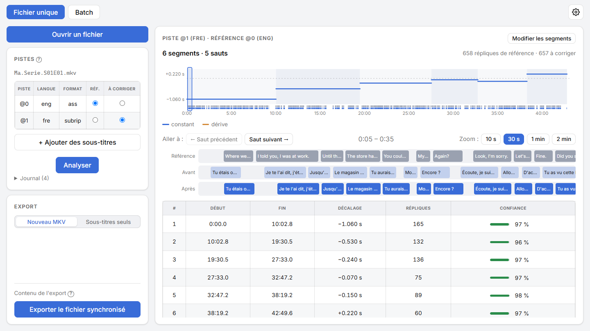
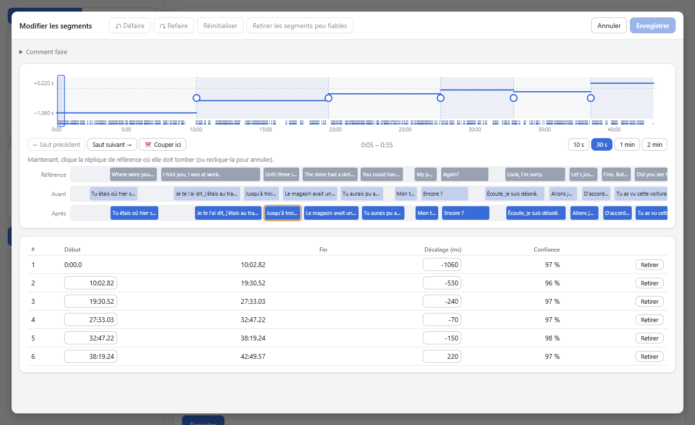

<a href="README.md">English</a> | Français

  

<h1 align="center">Bobine Subs</h1>

  <b>Recale des sous-titres sur ceux déjà présents dans la vidéo</b> : décalage, dérive et sauts, d'une langue à l'autre.

  
  
  
  

  

<picture>
  <source media="(prefers-color-scheme: dark)" srcset="docs/screenshots/main-dark.png">
  
</picture>

## Pourquoi

Des sous-titres récupérés à part collent rarement à la vidéo : quelques dixièmes de seconde d'avance, un écart qui **dérive** peu à peu parce qu'ils ont été faits pour une autre cadence d'images (25 i/s au lieu de 23,976), ou des **sauts** là où la vidéo a été montée autrement (une coupure pub plus longue, une scène en moins). Les recaler à la main, réplique par réplique, est interminable.

Or la vidéo contient souvent déjà des sous-titres bien calés, dans une autre langue. Ce qu'ils ont en commun avec ceux à corriger n'est pas le texte, mais le **rythme** : les mêmes répliques s'affichent aux mêmes moments, avec les mêmes silences entre elles. Bobine Subs compare ce rythme, et recale chaque réplique.

## Fonctionnalités

- 🎯 **Trouve les trois types de décalage** : constant, dérive (les cadences classiques : 23,976, 24, 25 i/s), sauts, chaque segment avec un score de confiance.
- 🌍 **D'une langue à l'autre** : VO anglaise contre VF, japonaise contre anglaise… seul le moment où les répliques s'affichent compte.
- 💿 **Toutes les références** : SRT et ASS, mais aussi les sous-titres image des Blu-ray (PGS) et des DVD (VobSub), dont seul l'horaire est lu.
- 👀 **Vérifier avant d'exporter** : la courbe des décalages, et une loupe qui montre côte à côte les répliques de la référence et celles à corriger, avant et après, avec leur texte.
- ✏️ **Corriger à la main si besoin** : glisser un segment ou une frontière, couper, retirer une fausse détection, **aligner** une réplique sur la bonne d'un clic, défaire / refaire.
- 📦 **Un export propre** : un nouveau MKV où la piste corrigée remplace l'originale ou s'ajoute, sans rien réencoder, ou le fichier de sous-titres seul. Le fichier d'origine n'est jamais modifié.
- 🗂️ **Une série entière en une passe** : des vidéos et leurs fichiers de sous-titres, associés d'après le numéro d'épisode (`S01E03`, `1x03`…), ou des vidéos contenant chacune les deux pistes.
- 🖱️ **Glisser-déposer** de fichiers ou de dossiers entiers, thème clair ou sombre, mises à jour automatiques.

## Installation

**Windows 10 et 11 :**

1. Télécharge `Bobine.Subs_x.y.z_x64-setup.exe` depuis la [dernière release](https://github.com/MarcValat/BobineSubs/releases/latest).
2. Lance-le. L'installateur n'est pas signé par un certificat, Windows SmartScreen peut donc afficher *« Windows a protégé votre ordinateur »* : clique sur **Informations complémentaires**, puis **Exécuter quand même**.

**Linux** (Ubuntu 22.04 ou plus récent, Debian et leurs dérivées : Linux Mint, Pop!_OS…) :

1. Télécharge `Bobine.Subs_x.y.z_amd64.deb` depuis la [dernière release](https://github.com/MarcValat/BobineSubs/releases/latest).
2. Installe-le depuis son dossier avec `sudo apt install ./Bobine.Subs_x.y.z_amd64.deb`, puis lance-le depuis le menu des applications ou avec `syncsubtitles`.

Rien d'autre à installer : le moteur d'analyse et ffmpeg sont fournis avec l'application. Quand une nouvelle version sort, l'application la propose et l'installe en un clic (sous Linux, après avoir demandé ton mot de passe).

## Comment ça marche

1. **Ouvre la vidéo** (ou dépose-la sur la fenêtre) : ses sous-titres bien calés servent de **référence**. Choisis les sous-titres **à corriger** : une autre piste de la même vidéo, ou un fichier SRT/ASS à part.
2. **Analyse** : la courbe montre les segments trouvés. Vérifie dans la loupe que les répliques tombent en face des bonnes, et ajuste les segments à la main si quelque chose cloche.
3. **Exporte** : un nouveau MKV à côté de l'original (`Film.synced.mkv`), ou les sous-titres seuls.

📖 Le [guide d'utilisation](docs/guide.fr.md) détaille tout : lire le résultat, l'éditeur de segments, le mode série, les questions fréquentes.

<picture>
  <source media="(prefers-color-scheme: dark)" srcset="docs/screenshots/editor-dark.png">
  
</picture>

## Bon à savoir

- La référence doit contenir **les mêmes répliques** que les sous-titres à corriger. Une piste « forcée » (seulement les panneaux et les passages en langue étrangère) n'a pas assez de répliques : l'application la laisse de côté quand elle choisit la référence, et prévient si tu l'imposes.
- Les répliques qui ne sont pas du dialogue (`[Musique]`, `(rires)`, paroles de chansons, panneaux et karaoké en ASS) sont ignorées pour le calage, mais recalées comme les autres.
- Quand les sous-titres contiennent une scène absente de la vidéo (ceux d'une version longue, par exemple), ses répliques sont retirées ; une à trois répliques au bord de cette scène peuvent être mal tranchées : l'export liste chaque réplique retirée.
- Les sous-titres à corriger doivent être du texte (SRT, ASS) : des sous-titres image peuvent servir de référence, pas être recalés.

## Pour les développeurs

- [`engine/`](engine/README.md) : le moteur Python (lecture des pistes, détection, recalage, mux, serveur HTTP local) ; utilisable seul en ligne de commande.
- [`app/`](app/README.md) : l'application (Tauri + React/TypeScript), qui pilote le moteur ; compilation, empaquetage et publication d'une release.

## Licence

Copyright © 2026 Marc Valat. Bobine Subs est un logiciel libre, distribué sous [licence publique générale GNU v3](LICENSE) : tu peux l'utiliser, l'étudier, le partager et le modifier, et toute version distribuée, modifiée ou non, doit rester sous la même licence avec son code source disponible.

L'installateur fournit aussi [FFmpeg](https://ffmpeg.org/) (une version de [gyan.dev](https://www.gyan.dev/ffmpeg/builds/), via [imageio-ffmpeg](https://github.com/imageio/imageio-ffmpeg)), que Bobine Subs lance comme programme séparé. Cette version est elle aussi sous GPL v3 ; son code source est disponible auprès de FFmpeg et de gyan.dev.
