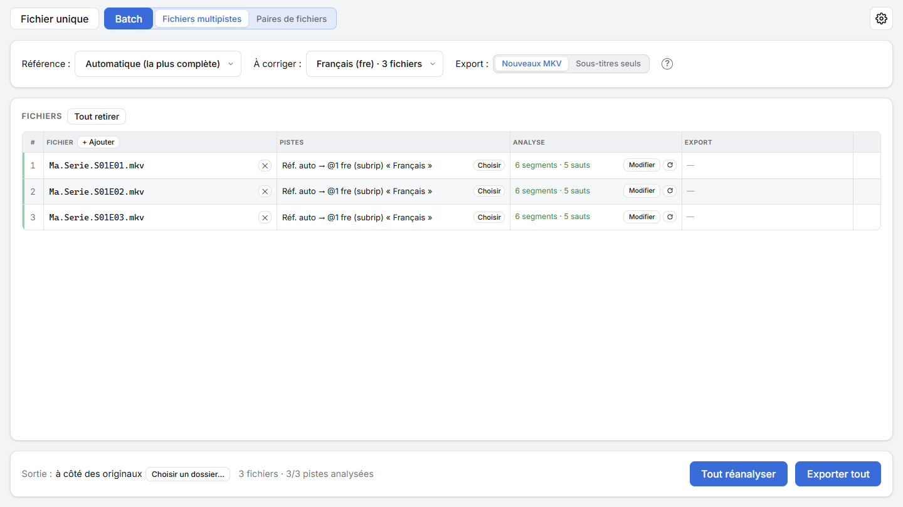

English | <a href="guide.fr.md">Français</a>

# User guide

This guide explains how to use Bobine Subs, from opening a video to exporting, for one file or a whole series. For installing it, see the [README](../README.md#install). The interface is in French: its labels are quoted below in French, with their meaning.

## Contents

1. [Words to know](#words-to-know)
2. [One file at a time](#one-file-at-a-time)
3. [Reading the result](#reading-the-result)
4. [Correcting the segments by hand](#correcting-the-segments-by-hand)
5. [Exporting](#exporting)
6. [A whole series](#a-whole-series)
7. [Options](#options)
8. [FAQ](#faq)

## Words to know

- **Reference** (*Référence*): the subtitles already in sync with the video, usually the original version's. They're never changed: they're the benchmark. Their language doesn't matter.
- **Subtitles to fix** (*À corriger*): the out-of-sync ones, say a French track downloaded separately. Bobine Subs retimes them onto the reference.
- **Offset** (*Décalage*): the gap between the two at a given moment. **+** means the subtitles to fix come **late**, **−** that they come **early**.
- **Segment**: a stretch of the video over which the offset follows one rule. Subtitles off by a fixed amount have one segment; a video edited differently (ad breaks, scenes added or cut) has several.
- **Constant, drift, jump**:
  - *constant*: the offset stays the same over the whole segment;
  - *drift*: it grows little by little, because the subtitles were made for another frame rate (25 fps instead of 23.976, for instance);
  - *jump*: it changes at once between two segments.
- **Confidence** (*Confiance*): the share of a segment's lines that land in front of reference lines, from 0 to 100 %. Under 80 %, the segment is flagged **⚠**: worth checking.

## One file at a time

This is the **Fichier unique** (single file) mode, top left.

1. **Open the video** with "Ouvrir un fichier" (open a file), or drop it on the window. The **Pistes** (tracks) panel lists its subtitle tracks (hover a row to see its title; **(F)** marks forced subtitles). A reference can also be a well-timed SRT/ASS file, if that's all you have.
2. **Tick the reference** in the **Réf.** column: one track is ticked from the start (a full track rather than a forced one, text rather than image). Image subtitles (Blu-ray, DVD) can be a reference.
3. **Tick the subtitles to fix** in the **À corriger** column: another track of the same video (ticked from the start when the video holds two), or a separate file, added with "**+ Ajouter des sous-titres**" (add subtitles: an SRT/ASS, or another video whose track will be used). Dropping an SRT/ASS on the window does the same.
4. **Analyser** (analyze): a few seconds. The **Journal** (log) shows how it's going, and "Annuler" (cancel) stops it.

## Reading the result

On the right, the analysis panel is titled with the corrected track and its reference ("Piste @1 (fre) · référence @0 (eng)").

- **At the top**, the summary: "Décalage constant de −1,060 s" (constant offset) or "6 segments · 5 sauts" (jumps), a **drift** if any ("Dérive : 23,976 -> 25 i/s"), and the line counts.
- **The curve** shows the offset along the video, one line per segment: **blue** for a constant offset, **orange** for a drift, **dashed** (on a reddish band) for an unreliable segment. The legend is under the curve. The dashes below it show where the lines are: the reference's above, the corrected ones below.
- **The close-up**, under the curve, shows 10 s to 2 min of the video on three rows:
  - **Référence**: the reference's lines, with their text;
  - **Avant** (before): the subtitles to fix, as they are;
  - **Après** (after): the same once corrected.

  If all is well, each line of the "Après" row lands in front of the reference line that says the same thing. Click the curve to move the close-up, or use "Aller à : Saut précédent / suivant" (previous / next jump) to look at each jump. Hover a line to read its full text and times.
- **The segments table** gives each one's start and end, its offset (in orange for a drift, from the segment's start to its end), its line count and its **confidence**, as a gauge: green when the segment is reliable, red with ⚠ when it's worth checking.
- "**sans équivalent**" (no counterpart) counts the lines with no line in front of them in the reference: a line added by the translator, a tag like `[FRENCH]`, a non-dialogue line (`[Music]`, lyrics…). They're retimed anyway, with their segment.

## Correcting the segments by hand

"Modifier les segments" (edit the segments) opens the editor ("Corriger manuellement les segments"), for when the detection got something wrong. Everything you do there shows at once in the close-up.

- **Drag a segment** up or down to change its offset.
- **Drag a handle ●** to move the boundary between two segments.
- **Split**: double-click the curve, or "✂ Couper ici" (cut here) to split at the close-up's center.
- **Align**: the fastest when you can see a passage is off. In the close-up, click a line of the "Après" row, then the reference line that says the same thing: its whole segment shifts so they start together.
- **The table** lets you type a boundary (`10:02.82`) or an offset in milliseconds, at the segment's start ("Décal. début") and end ("Décal. fin"): two different values make it a drift.
- **Retirer** (remove) deletes a segment (a false detection): its neighbour stretches over it, with its own offset. "Retirer les segments peu fiables", at the bottom, does it for every ⚠ segment.
- **Défaire / Refaire** (undo / redo, Ctrl+Z / Ctrl+Y) and **Réinitialiser** (back to the segments as opened), bottom left.

"Enregistrer" (save) keeps your segments: the result is then marked "Modifié à la main" (edited by hand), and the export applies them as they are, without detecting anything again. "Annuler" or Esc closes the editor, asking first if you changed something.

## Exporting

The **Export** panel, under the tracks, picks what's written:

- **Nouveau MKV** (new MKV): a copy of the video, nothing re-encoded.
  - When the track to fix comes from the video, the corrected track **replaces** the original, in the same place, with the same language and title.
  - When it comes from a separate file, it's **added**. Its language is the file's (guessed from its name: `Film.fr.srt`, `episode-VF.srt` → French), or picked from the list; you can give it a title and make it the default track.
- **Sous-titres seuls** (subtitles only): the corrected SRT/ASS file. In ASS, styles, positions and effects are kept as they are: only the times change.

"**Exporter le fichier synchronisé**" (export the synced file) opens the save dialog, with a name suggested next to the original (`Film.synced.mkv`): confirm it, or pick another folder or name. "Contenu de l'export (?)" tells what the file will hold.

- The original file is never changed. A cancelled export leaves no half-written file.
- Once the export is done, "Ouvrir le dossier" (open the folder) shows the written file, and the lines removed (falling before the video's start, or in a scene it doesn't have) are listed.

## A whole series

The **Batch** mode, top left, handles several episodes in one go. Clicking it unfolds its two ways of working (the last one used is remembered):

- **Fichiers multipistes** (multi-track files): videos that each hold the reference and the track to fix. Pick the **language of the track to fix** in the settings bar ("À corriger :").
- **Paires de fichiers** (file pairs): on one side the reference videos, on the other what's to fix, one per episode: SRT/ASS files, or videos whose track will be used (picked by language, as above). Each file is matched to its episode by the **number in its name** (`S01E03`, `1x03`, `E03`, `Episode 3`…), even when the names differ. Files with no shared number are matched in order, flagged "ordre"; the ↑ ↓ arrows fix the order of the "À corriger" column.

Add files with "+ Ajouter" at the top of a column, or drop them on the window, folders included (in pairs: on the left half for references, on the right for what's to fix).

In the settings bar:

- **Référence**: "Automatique (la plus complète)" (the most complete), or the reference track's language, for every file;
- **Export**: "Nouveaux MKV" or "Sous-titres seuls", and in pairs the added track's language and title.

"**Choisir**" (choose), on a row, picks that file's reference and track to fix by hand, when the language rule doesn't fit; the row is then marked "(manuel)", and "Par langue" (by language) goes back to the rule.

Then:

1. **Analyser tout** (analyze all): one episode after another; those waiting their turn are "En attente". Each row shows its summary, with "⚠ à vérifier" (to check) if a segment is unreliable or lines will be removed. **Modifier** (edit) opens that episode's editor, even while the others are being analyzed; the ↻ icon analyzes that row alone again.
2. **Exporter tout** (export all), to the **Sortie** (output) picked at the bottom ("à côté des originaux", next to the originals, or "Choisir un dossier…", choose a folder):
   - in another folder, each copy keeps the original's name (`My.Show.S01E03.mkv`), unless it's taken;
   - next to the originals, it's `My.Show.S01E03.synced.mkv`;
   - in "Sous-titres seuls", a separate file keeps its name, and a track taken from a video becomes `Film.fre.srt`, which players load on their own.

   The folder icon, at the end of the row, opens the written file's folder.

A colored bar at the left of each row tells where it stands: blue running, pale blue waiting, pale green analyzed, green exported, red failed. Once everything is analyzed, the button becomes "Tout réanalyser" (analyze everything again, losing the edits made with "Modifier").

<picture>
  <source media="(prefers-color-scheme: dark)" srcset="screenshots/batch-dark.png">
  
</picture>

## Options

The ⚙ button, top right, sets the **theme** (the system's, light or dark) and the **update check** at startup.

## FAQ

**The analysis finds nothing good / confidence is low everywhere.**
The reference and the subtitles to fix probably don't hold the same lines: a forced track picked as reference, another episode's subtitles, or a very different version's. Check in the close-up that the lines look alike.

**A jump is in the wrong place, or a segment shouldn't be there.**
Open the editor: move the boundary, remove the segment, or use *Aligner* on a line of that passage.

**The subtitles were made for another frame rate.**
That's drift: it's detected and corrected on its own for the usual rates (23.976, 24, 25 fps), and shown in the summary.

**Can I retime PGS (Blu-ray) or VobSub (DVD) subtitles?**
Not yet: they can be a reference, but only text subtitles (SRT, ASS) can be retimed.

**Where did that line go?**
It may have fallen before the video's start, or in a scene the video doesn't have: the export lists every removed line, with its time.
